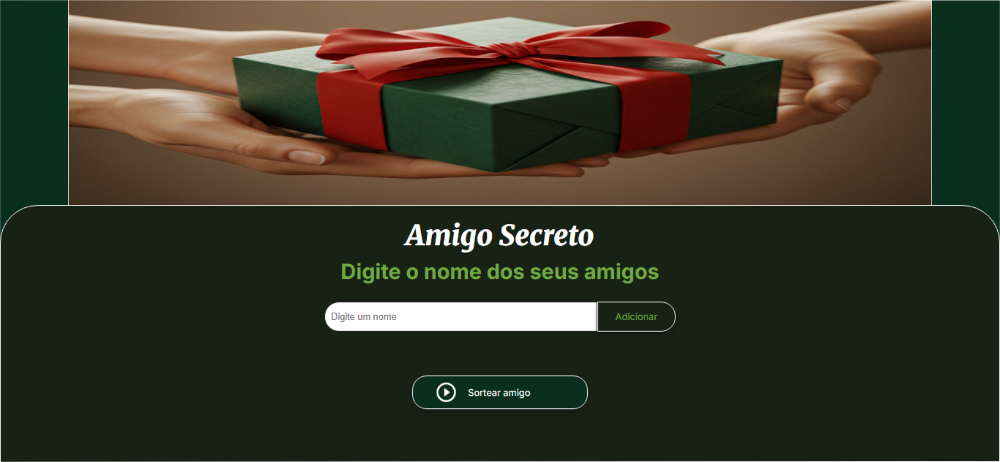

# ✨🎮 Jogo Amigo Secreto 🎮✨

## Sobre o Projeto
O Amigo Secreto é um jogo simples e divertido que permite aos usuários adicionar nomes de amigos em uma lista e realizar um sorteio aleatório para determinar quem é o amigo secreto de cada um. Este projeto foi desenvolvido como parte do programa One Oracle Next Education, sob a orientação dos professores da Alura.

## Como Usar
* Abra o jogo em seu navegador.
* Digite o nome de um amigo no campo de texto.
* Clique no botão adicionar.
* Repita os passos 2 e 3 para adicionar todos os amigos que participarão do sorteio.
* Clique no botão Sortear Amigo .
* O resultado do sorteio será exibido na tela, * indicando quem é o amigo secreto de cada participante.

## Tecnologias Empregadas

## Funcionalidades
* Adicionar nomes de amigos à lista.
* Validar a entrada de dados (verificar se o campo de texto está vazio);
* Exibir a lista de amigos adicionados.
* Realizar um sorteio aleatório para determinar o amigo secreto de cada participante.
* Exibir o resultado do sorteio na tela.

## Destaque
* Interface intuitiva e fácil de usar.
* Design moderno e atraente.
* Código limpo e bem estruturado.
* Jogo divertido e ideal para confraternizações e festas.

## Acesso ao projeto
[Jogo Amigo Secreto](https://lucianafreitag.github.io/challenge-amigo-secreto.github.io/) 

## Créditos e Agradecimentos
Estou muito alegre por fazer parte do programa <a href="https://www.oracle.com/br/education/oracle-next-education/">ONE - Oracle Next Education</a>. Agradeço a **Alura Latam**, **Oracle** e aos **colegas da comunidade do programa**, que estiveram prontos a me ajudar quando precisei.

## Autora
 Luciana Freitag
https://github.com/lucianafreitag |
| :---: |
